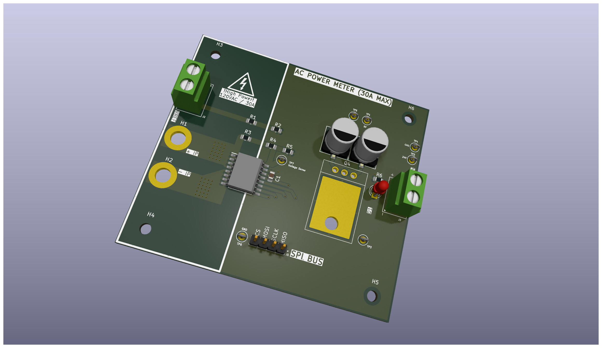
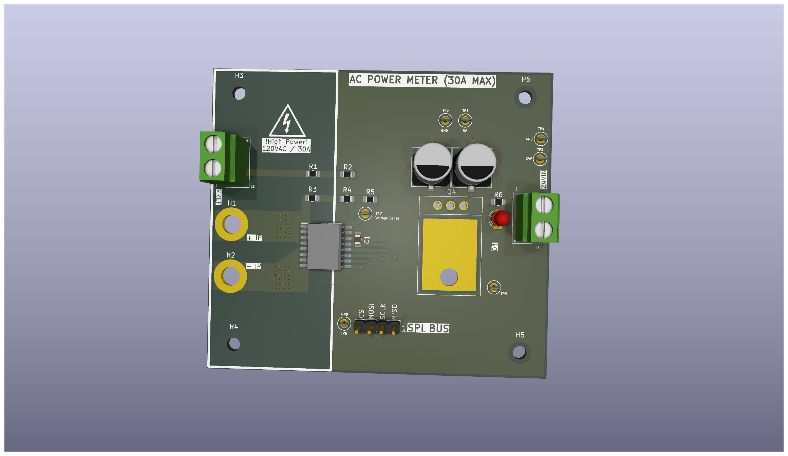
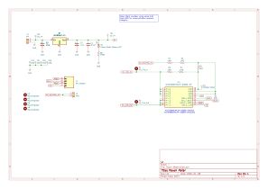

# AC Mains Power Monitor

A compact AC power measurement module built around the Allegro ACS37800. Originally designed to add per-channel metering to a PDU build — ended up being general enough to document separately.

---

## Background

I needed power metering on a PDU I was building and wanted something I could drop onto an existing board without a lot of external circuitry. The ACS37800 handles current sensing, voltage sensing, and power computation on-chip and spits everything out over SPI — so the host MCU just reads registers. That was the appeal.

The board ended up being general enough that it could be used in other contexts too, so I'm documenting it here. It's Rev 1 and there are things I'd change — those are in the roadmap below.

---

## Specifications

| Parameter | Value |
|---|---|
| AC Input Voltage | 120VAC (mains) |
| Max Continuous Current | 30A |
| DC Supply Voltage | 24V |
| Logic Supply (onboard regulated) | 5V |
| Current Sensing Method | Hall-effect (contactless, no shunt) |
| Voltage Sensing Method | Resistor divider (R1–R4: 1MΩ each, R5: 3kΩ) |
| Host Interface | SPI (CS, MOSI, SCLK, MISO) |
| Power IC | Allegro ACS37800KMACTR-030B5-SPI |
| Voltage Regulator | AS7805AT-E1 (24V → 5V) |
| Measured Quantities | Real power, apparent power, RMS voltage, RMS current |
| Test Points | 7 (5V, VIN, Voltage Sense, 4× GND) |
| Mounting | 4× mounting holes (H3–H6) |
| Status Indicator | Power status LED (D1, 450Ω) |
| PCB Tool | KiCad |

---

## IC Selection — ACS37800

The [ACS37800](https://www.allegromicro.com/en/products/sense/current-sensor-ics/zero-to-fifty-amp-integrated-conductor-sensor-ics/acs37800) was the right choice for this for a few reasons:

**Contactless current sensing.** Current flows through the PCB conductor between the board apertures (H1/H2) — no shunt resistor in the AC path. No I²R heating, no insertion loss, no extra dissipation at high current. At 30A continuous that adds up.

**On-chip power computation.** Real power, apparent power, power factor, RMS voltage, and RMS current are all computed on the IC. The host MCU just reads registers over SPI — no signal conditioning, no ADC math on the firmware side.

**Small package.** The SOIC-16 footprint was intentional. This was always meant to be embedded inside something larger, not used standalone. Keeping the IC footprint tight kept the overall board size manageable for integration into an existing PDU assembly.

**Voltage variant flexibility.** The 5V variant (030B5) is populated here. The 3.3V variant (030B3) is pin-compatible — relevant if you're running a 3.3V MCU and want to avoid level shifting. There's a note on the schematic about this for Rev 2.

---

## Circuit

---

## Board Layout

The board is split into two zones:

**Left — high voltage.** AC line terminals, current sensing apertures (H1/H2), high-voltage warning silkscreen. Copper pours here carry the full AC mains current.

**Right — low voltage logic.** ACS37800, voltage regulator, bulk capacitors, SPI header, test points, status LED.

Keeping these zones physically separated reduces coupling between the high-current AC path and the low-level analog sensing inputs on the IC. The boundary is visible in the silkscreen on the board.

---

## Connector Pinout

**J1 — SPI Header (4-pin)**

| Pin | Signal |
|---|---|
| 1 | MISO |
| 2 | SCLK |
| 3 | MOSI |
| 4 | CS |

**J2 — VREF**

| Pin | Signal |
|---|---|
| 1 | AC_NEUTRAL_IN |
| 2 | VREF |

**J3 — 24V Power Input**

**J5 — AC Line Output**

---

## Test Points

| Label | Signal | Notes |
|---|---|---|
| TP1 | 5V | Regulated output |
| TP2 | VIN | 24V input rail |
| TP3–TP6 | GND | Ground references |
| TP7 | Voltage Sense | ACS37800 VINP node — useful for verifying the resistor divider during bring-up |

---

## Integration Notes

- MCU-agnostic. Any SPI-capable controller can interface with the ACS37800 directly.
- The ACS37800 SPI interface runs at up to 10MHz. Check your MCU's SPI clock polarity and phase settings against the ACS37800 datasheet (CPOL=0, CPHA=1).
- The 5V logic variant is populated. For 3.3V MCUs, either use a logic level shifter on the SPI lines or swap to the ACS37800KMACTR-030B3-SPI (3.3V, pin-compatible).
- 24V supply required. The onboard regulator handles the rest.
- **AC mains voltage is present on the left side of this board. Take appropriate precautions.**

---

## Where This Could Go

A few directions this board could be taken with more time:

**Standalone sensor.** Right now it needs a host MCU. An obvious next step would be integrating an ESP32 directly on the board — handle everything onboard, push readings to an LCD, a phone, or a web dashboard over Wi-Fi without any external hardware required.

**Broader use cases.** Originally built for a PDU, but the same module could sit inside smart home panels, EV charging stations, industrial equipment monitoring setups, or anywhere mains power metering is needed without a lot of external circuitry.

---

## Rev 2 Roadmap

Things I'd change in the next revision:

- **Thermal planning** — properly size copper area and trace width on the high-current AC path for sustained 30A. Not fully analyzed in Rev 1.
- **Tighter layout** — significant empty board space in Rev 1. Next revision would shrink the footprint considerably.
- **SPI pull-up pads** — add optional footprints for SPI line pull-up resistors. Useful depending on host MCU and line length.
- **More test points** — additional coverage on the ACS37800 supply pins and SPI lines would speed up bring-up on future revisions.
- **Improved terminals** — evaluate screw terminal pitch and current rating against alternatives better suited for mains wire gauge.
- **3.3V logic by default** — consider populating the 3.3V IC variant to remove the level-shifting requirement for 3.3V MCU hosts.
- **EMC hardening** — TVS diode on AC input, common-mode filtering on the mains sense lines.

---

## Tools

| Tool | Purpose |
|---|---|
| KiCad | Schematic capture, PCB layout, 3D render |
| Oscilloscope | Bring-up verification |

---

## License

Shared for reference and learning purposes.

Licensed under [CC BY-NC-ND 4.0](https://creativecommons.org/licenses/by-nc-nd/4.0/) — you may view and share with attribution. Not licensed for fabrication, modification, or commercial use.# AC-Power-Meter
